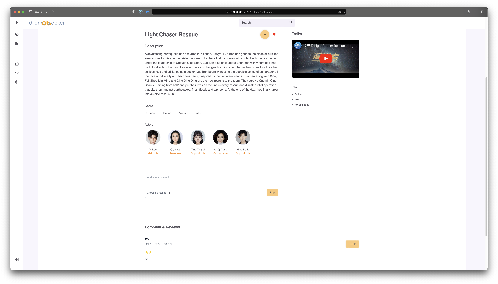
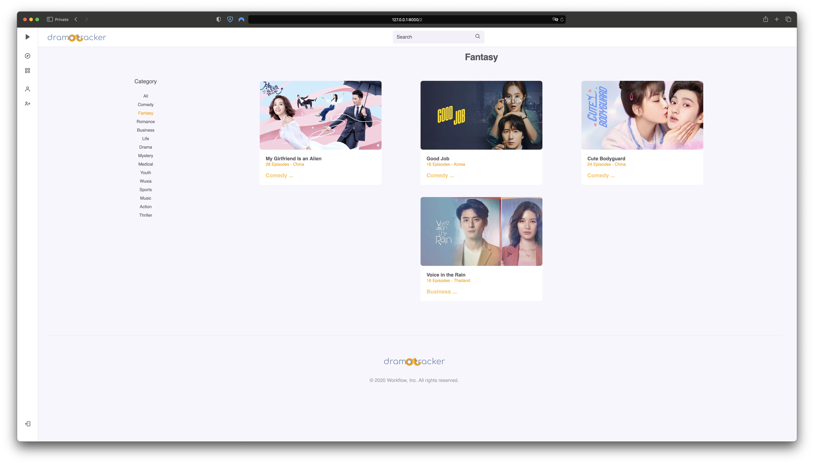
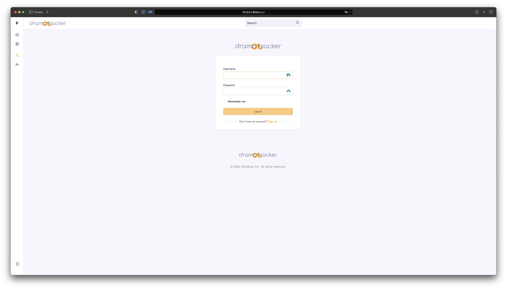
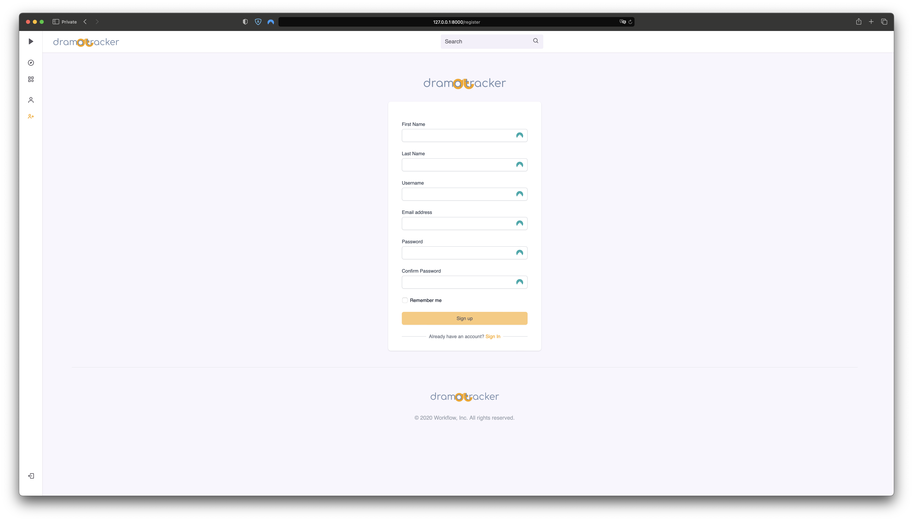
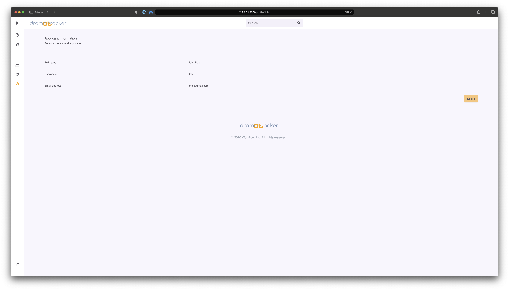

# Final-Project !

Web Programming with Python(Django) and JavaScript

# Introduction

This project is an online and personal drama/asian-serie-tv tracker. Users can, navigate and search their favorite drama and see all the details and only after registering or sign-in, they can likes, put the drama in his watchlist, so that they can always know what they are watching, what they like and what they watched.

## Why I developed this project:

I wanted to create this drama tracker web applications for all the asian tv series, because there aren't many useful ones online and if they are they have ads or have a bad design. For this reason i wanted a web application that is easy to use and navigate with a simple design but with all the details and information that it needs to keep track.

## Distinctivness and Complexity

This project utilize Django on the back-end and JavaScript on the front-end as part of the requirements for the final project.  This is the combination of the previous project, meticulously integrated all I learned. This site is mobile responsive with the use of tailwind as a framework and some personal CSS to help my project to load fast and easier.
All HTML and CSS based design templates for forms, buttons, navigation, modals, image carousels... have given my project a good support for JavaScript and Python.
what makes this project more complex than previous one's is its detailed UI, allowing users to navigate with ease. It also features a search engine in the category section for better experience for the user, also to make it more complex there is a rating system for every drama, there is also an automatic page number. The Admin of the website will then can post new drama that will be released thanks to django-admin interface.
Every page and feature of the web application is mobile-responsive and this is achieved using tailwind and custom CSS.

# Project Structure

## Template Index Page

In the main/index page, you can see all the latest drama that are released and the upcoming drama, here you can like and add to the watchlist only if you are registered and logged-in 


## Template Drama Page

In the drama page, you can see all the details of the drama, here you can like and add to the watchlist and the user can also add a comment or review and can also put a rating for that drama only if you are registered and logged-in, also you can see the trailer, and the actors. 





## Template Category Page

In the category page, the user can see all the drama and can choose a category, here you can like and add to the watchlist only if you are registered and logged-in 




## Template Login Page

User can log into the website using a valid username and password.



## Template Register Page

User must enter their username, email address, first name, last name, password and confirm password. The page has the following validation:

1. The password must match the confirm password field
2. There is no existing user with the username provided

If the details are valid, a new user is created in the `User` model otherwise there will a pop up with an error.



## Template Watchlist Page

This section is avaible only if you are logged-in and here will be all the drama that the user want to watch or he just watched thanks to the button of add to watchlist, the user can add and remove dramas from the watchlist.


## Template Favorite Page

This section is avaible only if you are logged-in and here will be all the favorite drama that the user likes, the user can add and remove dramas from the watchlist.


## Template Profile Page

This section is avaible only if you are logged-in and here will be all the information about the user, the user can delete his account if he wants.



## logout

If the user clicks 'Logout' in the navigation bar, it will log the user out and redirect to the index page

## Template Layout

Here you can find the default template with the navigation all the file and link for the functions for the web application to work.

## app.js

The javascript contains 4 functions.

- The search function.
- the slider Function for the index.
- Function for the link active.
- Function to show and hide the navbar.

# Back End

## Super User
Super user is a feature provided by Django. The super user can manipulate all data in the [backend management dashboard](http://eswzy.pythonanywhere.com/admin/)-
Super user can also have a view of all users.


## Models

- User: where we find all the users account.
- Category: where we find all the category of the dramas.
- Region: where we find where dramas are made (country).
- Drama: where are all the dramas informations.
- Actors: where we find all tha ctors for all the dramas .
- Watchlist: where the user put the dramas that he wants to watch or is watching.
- Favorite: where the user put the dramas that he likes.
- Upcoming: the dramas that will be relased soon.
- Review: where we find all the comment and reviews of the users.

## urls

- index: shows the index and all latest dramas.
- login_view, logout_view and register: handle the creation and login of user accounts.
- profile: shows the information of the users.
- category: shows all dramas.
- choose_category: shows the dramas of that category.
- watchlist: shows the drama in the watchlist.
- watchlist_drama: add/remove drama to watchlist.
- favorite: shows the liked dramas.
- favorite_action: add/remove drama to favorite.
- drama: shows the detailsof the dramas.
- review: add and show the comment and review.
- d_review: remove the comment/review.

# How to run the application

install python

install django

clone or download the repository

go inside the folder

```shell script
cd cs50web-final-project
```
install the requirements

```shell script
pip install -r requirements.txt
```
Run those following commands to migrate database.

```shell script
python manage.py makemigrations
python manage.py migrate
```
When all is set you can run this command to run your server.

```shell script
python manage.py runserver
```
